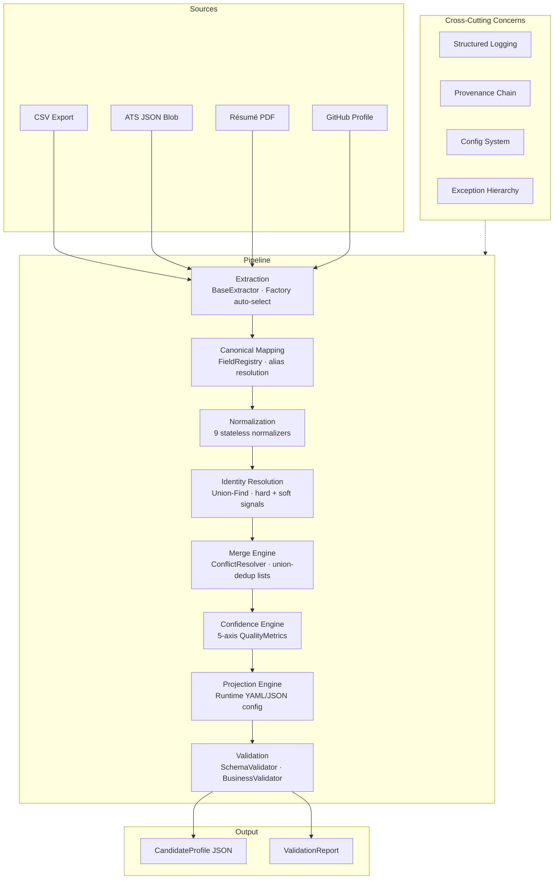
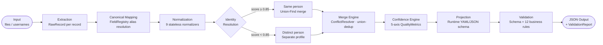

<div align="center">

# candidate-transformer

**Multi-Source Candidate Data Transformer**

*Ingest. Resolve. Merge. Score. Emit. — One canonical profile per real-world person.*

[](https://python.org)
[](tests/)
[](tests/)
[](.github/workflows/ci.yml)
[](LICENSE)
[](https://github.com/psf/black)
[](https://github.com/astral-sh/ruff)

</div>

---

## Overview

Recruiting tooling produces candidate records across disconnected systems: ATS exports, recruiter CSV sheets, uploaded résumés, and GitHub profiles. The same candidate appears in multiple sources with inconsistent formatting, conflicting field values, and varying completeness.

**candidate-transformer** is a production-grade, deterministic pipeline that:

1. Ingests records from any combination of four heterogeneous source types
2. Maps every source field to a single canonical schema
3. Normalizes all values to standard formats (E.164 phones, RFC email, ISO-3166 countries, YYYY-MM dates)
4. Clusters records by real-world identity using Union-Find over hard and soft signals
5. Merges clusters with configurable conflict resolution and full provenance tracking
6. Scores each profile across five quality axes
7. Projects the output to a runtime-configurable schema
8. Validates the result against schema and business rules before emission

Every merge decision is traceable. Every field has a source. The system never crashes on bad input — unknown values become `null` with a logged warning.

---

## Feature Matrix

| Feature | Description | Module |
|---|---|---|
| **Multi-source ingestion** | CSV, ATS JSON, Resume PDF, GitHub API | [`src/extractors/`](src/extractors/) |
| **Canonical schema** | Single `CandidateProfile` model, 16 fields | [`src/models.py`](src/models.py) |
| **Field registry** | Single source of truth for all field aliases | [`src/mapping/field_registry.py`](src/mapping/field_registry.py) |
| **9 normalizers** | Email, Phone (E.164), Date (YYYY-MM), Name, Company, Location, URL, Country, Skill | [`src/normalization/`](src/normalization/) |
| **Identity resolution** | Union-Find; hard signals (email, phone, GitHub, LinkedIn) + soft signals (name+company, name+location) | [`src/merge/identity_resolver.py`](src/merge/identity_resolver.py) |
| **Conflict resolution** | SOURCE\_PRIORITY, MAJORITY\_VOTE, MOST\_RECENT, MANUAL | [`src/merge/conflict_resolver.py`](src/merge/conflict_resolver.py) |
| **5-axis confidence** | Overall, Completeness, Consistency, Agreement, Freshness | [`src/merge/confidence_engine.py`](src/merge/confidence_engine.py) |
| **Provenance chain** | Per-field audit trail: extraction → mapping → normalization → conflict resolution | [`src/models.py`](src/models.py) · `Provenance` |
| **Runtime projection** | YAML/JSON config reshapes output at runtime — rename, transform, array\_path, conditional | [`src/projection/`](src/projection/) |
| **Validation** | SchemaValidator (7 rules) + BusinessValidator (12 rules) → `ValidationReport` | [`src/validation/`](src/validation/) |
| **SBERT skill normalization** | `all-MiniLM-L6-v2` as last-resort skill synonym resolver | [`src/normalization/skill_normalizer.py`](src/normalization/skill_normalizer.py) |
| **RapidFuzz matching** | Fuzzy skill match (threshold ≥ 0.88) before SBERT | [`src/normalization/skill_normalizer.py`](src/normalization/skill_normalizer.py) |
| **Factory pattern** | All extractors, mappers, normalizers, validators registered via factory | `factory.py` in each layer |
| **Structured logging** | JSON-compatible log output with stage, candidate\_id, elapsed\_ms context | [`src/logging_config.py`](src/logging_config.py) |
| **Config-driven** | Merge strategy, threshold, projection schema all runtime-configurable | [`src/config.py`](src/config.py) |
| **CLI** | `candidate-transform` with all 4 sources, format, merge strategy, projection config | [`src/cli.py`](src/cli.py) |
| **1,263 tests** | 35 test modules; unit + integration; all passing | [`tests/`](tests/) |

---

## Architecture



---

## Repository Structure

```
candidate-transformer/
│
├── src/
│   ├── models.py              # All Pydantic models: RawRecord, CanonicalRecord, CandidateProfile,
│   │                          #   Skill, Experience, Education, CandidateLink, QualityMetrics,
│   │                          #   Provenance, and all enums (SourceType, MergeStrategy, …)
│   ├── constants.py           # All thresholds, weights, regex patterns, ontology
│   ├── config.py              # Pydantic-Settings config system with env-var support
│   ├── exceptions.py          # Typed exception hierarchy (ExtractionError, MergeError, …)
│   ├── logging_config.py      # Structured JSON logging + context binding
│   ├── pipeline.py            # Top-level pipeline composition
│   ├── main.py                # run_pipeline(PipelineConfig) orchestrator
│   ├── cli.py                 # candidate-transform CLI entry point
│   │
│   ├── extractors/
│   │   ├── base.py            # BaseExtractor ABC
│   │   ├── csv_extractor.py   # Recruiter CSV → RawRecord[]
│   │   ├── ats_json_extractor.py  # ATS JSON blob → RawRecord[]
│   │   ├── resume_pdf_extractor.py # PDF → RawRecord (pdfplumber + pypdf fallback)
│   │   ├── github_extractor.py    # GitHub REST API → RawRecord
│   │   ├── utils.py           # Extractor shared utilities
│   │   └── factory.py         # ExtractorFactory (auto-select by path/URL pattern)
│   │
│   ├── mapping/
│   │   ├── field_registry.py  # FieldRegistry: canonical fields, aliases, types, priorities
│   │   ├── csv_mapper.py      # RawRecord[CSV] → CanonicalRecord
│   │   ├── ats_mapper.py      # RawRecord[ATS] → CanonicalRecord
│   │   ├── resume_mapper.py   # RawRecord[Resume] → CanonicalRecord
│   │   ├── github_mapper.py   # RawRecord[GitHub] → CanonicalRecord
│   │   └── factory.py         # MapperFactory (select by SourceType)
│   │
│   ├── normalization/
│   │   ├── base.py            # BaseNormalizer ABC
│   │   ├── pipeline.py        # NormalizationPipeline (ordered composition)
│   │   ├── email_normalizer.py    # Lowercase + RFC validation
│   │   ├── phone_normalizer.py    # → E.164 via phonenumbers
│   │   ├── date_normalizer.py     # 12 format patterns → YYYY-MM
│   │   ├── name_normalizer.py     # NFC + title-case
│   │   ├── company_normalizer.py  # Strip legal suffixes (Inc., Ltd., …)
│   │   ├── location_normalizer.py # city/state/country decomposition
│   │   ├── country_normalizer.py  # Country name → ISO-3166 alpha-2
│   │   ├── url_normalizer.py      # Enforce https://, strip trailing slash
│   │   ├── skill_normalizer.py    # Ontology → RapidFuzz → SBERT cascade
│   │   └── factory.py         # NormalizerFactory.build_default_pipeline()
│   │
│   ├── merge/
│   │   ├── identity_resolver.py   # Union-Find clustering over hard+soft signals
│   │   ├── conflict_resolver.py   # SOURCE_PRIORITY / MAJORITY_VOTE / MOST_RECENT / MANUAL
│   │   ├── merge_engine.py        # Per-field-type merge logic + union-dedup
│   │   ├── confidence_engine.py   # 5-axis QualityMetrics computation
│   │   ├── provenance_aggregator.py # Provenance chain aggregation
│   │   ├── pipeline.py            # MergePipeline composition
│   │   ├── utils.py               # Merge utilities
│   │   └── factory.py             # MergeFactory.build_default_pipeline()
│   │
│   ├── projection/
│   │   ├── config_resolver.py # Load YAML/JSON projection config
│   │   ├── field_selector.py  # Per-field spec: rename, transform, array_path, condition
│   │   ├── projector.py       # Projector.project() / project_many()
│   │   ├── utils.py           # Dot-path traversal, transform evaluation
│   │   └── factory.py         # ProjectorFactory.build() / build_minimal() / build_pass_through()
│   │
│   └── validation/
│       ├── schema_validator.py    # Structural: required fields, string length, email/phone/URL format
│       ├── business_validator.py  # Semantic: date ordering, duplicates, years_experience range, …
│       ├── validator.py           # Validator orchestrator: validate_one() / validate_batch()
│       ├── report.py              # ValidationReport: pass-rate, top violations, per-candidate results
│       └── factory.py             # ValidatorFactory.build() / build_strict() / build_lenient()
│
├── tests/                     # 35 test modules · 1,263 tests · all passing
│   ├── test_models.py
│   ├── test_csv_extractor.py
│   ├── test_json_extractor.py
│   ├── test_pdf_extractor.py
│   ├── test_github_extractor.py
│   ├── test_csv_mapper.py
│   ├── test_ats_mapper.py
│   ├── test_resume_mapper.py
│   ├── test_github_mapper.py
│   ├── test_*_normalizer.py   # (8 normalizer test modules)
│   ├── test_identity_resolver.py
│   ├── test_conflict_resolver.py
│   ├── test_merge_engine.py
│   ├── test_merge_pipeline.py
│   ├── test_projector.py
│   ├── test_validator.py
│   ├── test_cli.py
│   ├── test_pipeline_integration.py
│   └── …
│
├── configs/output_schemas/
│   ├── recruiter_view.yaml    # Lightweight: name, email, skills (flat), confidence
│   └── ats_export.yaml        # Full: all fields, provenance, quality_metrics
│
├── sample_data/
│   ├── recruiter_sample.csv       # Sample CSV input (5 candidates)
│   ├── ats_sample.json            # Sample ATS JSON input
│   ├── output_default.json        # Pipeline output — default schema
│   ├── output_recruiter_view.json # Pipeline output — recruiter_view config
│   └── output_ats_export.json     # Pipeline output — ats_export config
│
├── .github/workflows/ci.yml   # Ruff · Black · Mypy · Pytest + coverage
├── check_syntax.py            # Syntax-check all Python files
├── requirements.txt
├── design_document.html       # One-page engineering design review
├── DESIGN.md                  # Technical design document
├── BENCHMARKS.md              # Execution timing and scalability analysis
└── demo_script.md             # 2-minute demo walkthrough
```

---

## System Workflow



**Extraction** auto-selects the correct extractor by file extension or URL pattern. Each record is isolated — one failure does not abort the batch. **Mapping** resolves all source-specific field names against `FieldRegistry`; no mapper contains hardcoded field names. **Normalization** runs 9 stateless, idempotent normalizers in sequence; unknown values remain unchanged with a warning logged. **Identity Resolution** uses Union-Find with path compression: email, phone, GitHub handle, and LinkedIn slug are hard signals that immediately merge at any score ≥ 0.85; name+company and name+location contribute additive soft weights. Transitivity is free — if A≡B and B≡C then A≡C even without a direct A↔C signal. **Merge Engine** resolves scalar conflicts via one of four strategies and union-deduplicates all list fields by their normalised key. **Confidence Engine** computes per-field confidence (source weight + count bonus ± agreement delta) and aggregates into five quality axes. **Projection** applies a runtime YAML or JSON config to rename, transform, filter, or reorder fields. **Validation** runs structural and semantic checks and emits a `ValidationReport` with a pass rate, violation ranking, and per-candidate result.

---

## Core Engineering Concepts

### Canonical Model

`CandidateProfile` is a **frozen Pydantic v2 model**. Once the merge engine produces it, no downstream stage can mutate it. This eliminates an entire class of bugs where projection or validation logic accidentally modifies source-of-truth data. The model is the contract; the projection layer is a read-only view.

### Factory Pattern

Every layer — extractors, mappers, normalizers, the merge pipeline, projector, validator — is registered behind a `Factory`. Factories make the system open for extension without modifying existing code. Adding a new extractor is one `register()` call.

### FieldRegistry

All canonical field definitions (name, aliases, type, priority, required flag, description) live in one `FieldRegistry` instance. All four mappers reference it. Adding a new canonical field requires changing exactly one file.

### Deterministic Processing

No stage uses non-deterministic logic in the merge path. Conflict resolution strategies are fully rule-based. Given the same inputs and config, the system always produces the same output — essential for auditability and regression testing.

### SBERT — Scope and Justification

`sentence-transformers` (`all-MiniLM-L6-v2`) is used **only** in `SkillNormalizer`, and only as a last-resort fallback after exact ontology lookup and RapidFuzz fuzzy matching (threshold ≥ 0.88) both fail. The SBERT similarity threshold is 0.82. This keeps the merge path deterministic and avoids non-reproducible embeddings influencing identity or conflict decisions.

### RapidFuzz

`rapidfuzz.fuzz.token_sort_ratio` is used for skill fuzzy matching before SBERT is invoked. The threshold of 0.88 was chosen to reduce false positives ("Go" vs "Google Cloud") while catching common synonyms ("ML" → "Machine Learning").

### Provenance

Every field change across all processing stages appends a `Provenance` entry with: `field`, `source`, `method` (one of 11 `NormalizationMethod` enum values), `original_value`, `normalized_value`, `processing_stage`, `confidence`, `timestamp`, and `reason`. The full chain reads: `extraction → canonical_mapping → normalization → conflict_resolution`.

### 5-Axis Quality Metrics

`QualityMetrics` is computed by the `ConfidenceEngine` after merging:

| Axis | Formula |
|---|---|
| `overall_confidence` | `Σ(field_confidence × importance_weight) / Σ(importance_weight)` |
| `completeness` | `populated_expected_fields / total_expected_fields` |
| `consistency` | `1.0 − min(1.0, date_order_violations × 0.15)` |
| `agreement` | `agreed_multi_source_fields / total_multi_source_fields` |
| `freshness` | `exp(−ln(2) × age_days / 180)` — half-life of 180 days |

Per-field confidence = `mean(source_weights) + min(0.15, 0.10 × (source_count − 1)) ± agreement_delta`.

---

## Technology Stack

| Library | Version | Purpose |
|---|---|---|
| `pydantic` | 2.7.1 | Data validation, frozen models, type-safe serialization |
| `pydantic-settings` | 2.3.4 | Config management with env-var override |
| `structlog` | 24.2.0 | Structured, context-aware JSON logging |
| `sentence-transformers` | 3.0.1 | SBERT `all-MiniLM-L6-v2` for semantic skill matching |
| `rapidfuzz` | 3.9.3 | Token-sort fuzzy matching for skill normalization |
| `phonenumbers` | 8.13.39 | E.164 phone number parsing and normalization |
| `email-validator` | 2.1.2 | RFC-compliant email address validation |
| `pycountry` | 24.6.1 | ISO 3166-1 alpha-2 country codes |
| `pdfplumber` | 0.11.1 | Layout-aware PDF text extraction |
| `pypdf` | 4.2.0 | PDF fallback extractor |
| `httpx` | 0.27.0 | HTTP client for GitHub REST API |
| `pyyaml` | 6.0.1 | YAML projection config parsing |
| `python-dateutil` | 2.9.0 | Flexible date string parsing (12 supported formats) |
| `pytest` | 8.2.2 | Test framework |
| `pytest-cov` | 5.0.0 | Coverage reporting |
| `pytest-asyncio` | 0.23.7 | Async test support |

---

## Installation

### Prerequisites

- Python 3.10 or later
- pip 23+
- (Optional) A GitHub personal access token for GitHub extraction without rate limiting

### Quick Start

```bash
# Clone
git clone https://github.com/Jihaan-Jain/candidate-transformer.git
cd candidate-transformer

# Create virtual environment
python -m venv .venv

# Activate — Windows
.venv\Scripts\activate

# Activate — macOS / Linux
source .venv/bin/activate

# Install dependencies
pip install -r requirements.txt

# Verify installation
python check_syntax.py
python -m pytest tests/ -q --tb=short
```

### Verify the CLI is wired

```bash
python -m src.cli --help
```

Expected output:

```
usage: candidate-transform [-h] [--csv PATH] [--ats PATH] [--resume PATH]
                           [--github USERNAME] [--config PATH] ...
```

### Optional: GitHub token (recommended for --github)

```bash
# Windows
set GITHUB_TOKEN=ghp_your_token_here

# macOS / Linux
export GITHUB_TOKEN=ghp_your_token_here
```

Unauthenticated GitHub API requests are rate-limited to 60/hour. With a token the limit increases to 5,000/hour.

<details>
<summary>Troubleshooting installation</summary>

**`sentence-transformers` fails to install**

```bash
pip install sentence-transformers --no-build-isolation
```

**`pdfplumber` fails on Windows**

```bash
pip install pdfminer.six
pip install pdfplumber
```

**`phonenumbers` import error**

```bash
pip install phonenumbers --upgrade
```

**`pycountry` not found**

```bash
pip install pycountry
```

**SBERT model not downloaded yet**

The SBERT model (`all-MiniLM-L6-v2`) is downloaded automatically on first use from HuggingFace (~90 MB). If you are offline, pre-download it:

```python
from sentence_transformers import SentenceTransformer
SentenceTransformer("all-MiniLM-L6-v2")
```

</details>

---

## Running the Project

### Default — CSV + ATS, full output schema

```bash
python -m src.cli \
  --csv  sample_data/recruiter_sample.csv \
  --ats  sample_data/ats_sample.json \
  --output output/profiles.json \
  --report output/report.json \
  --verbose
```

Console output:

```
✓ 4 candidates processed  ·  4 valid  ·  0 invalid  ·  2 warnings  ·  449ms
```

### Custom projection config

```bash
# Recruiter view — name, email, skills as flat strings, confidence only
python -m src.cli \
  --csv sample_data/recruiter_sample.csv \
  --ats sample_data/ats_sample.json \
  --config configs/output_schemas/recruiter_view.yaml \
  --output output/recruiter.json

# ATS export — all fields, provenance, quality metrics
python -m src.cli \
  --csv sample_data/recruiter_sample.csv \
  --ats sample_data/ats_sample.json \
  --config configs/output_schemas/ats_export.yaml \
  --output output/ats.json
```

### Multiple sources + GitHub

```bash
python -m src.cli \
  --csv      data/candidates.csv \
  --ats      data/ats.json \
  --resume   data/cv.pdf \
  --github   johndoe \
  --merge-strategy majority_vote \
  --match-threshold 0.80 \
  --output output/profiles.json \
  --report output/report.json \
  --verbose
```

### JSONL streaming output

```bash
python -m src.cli --csv data/candidates.csv --format jsonl
```

### Minimal output (id, name, email, skills only)

```bash
python -m src.cli --csv data/candidates.csv --minimal --output output/slim.json
```

### CLI Reference

| Flag | Default | Description |
|---|---|---|
| `--csv PATH` | — | Recruiter CSV file. Repeatable. |
| `--ats PATH` | — | ATS JSON export. Repeatable. |
| `--resume PATH` | — | PDF/TXT résumé file. Repeatable. |
| `--github USERNAME` | — | GitHub username. Repeatable. |
| `--config PATH` | — | Projection config YAML or JSON. |
| `--merge-strategy` | `source_priority` | `source_priority` · `majority_vote` · `most_recent` · `manual` |
| `--match-threshold` | `0.85` | Identity resolution minimum score (0.0–1.0). |
| `--output PATH` | stdout | Write JSON output to file. |
| `--report PATH` | — | Write `ValidationReport` to file. |
| `--format` | `pretty` | `json` · `jsonl` · `pretty` |
| `--minimal` | off | Minimal projection: id, name, email, skills only. |
| `--no-fail-on-error` | off | Continue even when validation errors are found. |
| `--verbose` / `-v` | off | Enable DEBUG logging. |

### Programmatic API

```python
from src.main import run_pipeline, PipelineConfig

result = run_pipeline(PipelineConfig(
    csv_paths=["data/candidates.csv"],
    ats_paths=["data/ats.json"],
    merge_strategy="majority_vote",
    match_threshold=0.80,
    output_path="output/profiles.json",
    report_path="output/report.json",
    verbose=True,
))

print(f"{result.profile_count} profiles · pass rate: {result.validation_report.pass_rate:.1%}")
```

---

## Configuration

### Projection Config (YAML)

The projection layer accepts a YAML or JSON file that reshapes the output without touching the pipeline:

```yaml
# configs/output_schemas/recruiter_view.yaml
version: "1.0"
include_confidence: true
include_provenance: false
include_quality_metrics: false
missing_field_strategy: "omit"   # omit | null | error | default

fields:
  - source: "full_name"
    output: "name"
    transform: "title"           # uppercase | lowercase | title | truncate:N | first | last | count | str | int | float | bool | join:sep

  - source: "emails"
    output: "primary_email"
    transform: "first"

  - source: "location.city"      # dot-path traversal into nested fields
    output: "city"

  - source: "skills"
    output: "skills"
    array_path: "normalized_name" # extract sub-field from object array → flat string list

  - source: "years_experience"
    output: "years_exp"
    default: 0

  - source: "overall_confidence"
    output: "confidence_score"
    condition: "overall_confidence > 0"  # skip field when condition is falsy

drop:
  - provenance
  - quality_metrics
```

### Source Priority (SOURCE\_PRIORITY constant)

| Source | Priority | Trust Weight |
|---|---|---|
| ATS | 1 (highest) | 0.90 |
| GitHub | 2 | 0.85 |
| CSV | 3 | 0.75 |
| Recruiter Notes | 4 | 0.65 |
| Résumé | 5 (lowest) | 0.60 |

### Identity Resolution Thresholds

| Constant | Value | Effect |
|---|---|---|
| `IDENTITY_MATCH_THRESHOLD` | `0.85` | Score at or above this → records merged |
| `IDENTITY_REVIEW_THRESHOLD` | `0.70` | Score between 0.70–0.85 → flagged for human review |

---

## Input Formats

### Recruiter CSV

Standard delimited file. The field registry resolves all common column name variants automatically.

```csv
name,email,phone,title,company,skills,years_experience,location,linkedin,github
Alice Smith,alice@example.com,+14155552671,ML Engineer,TechCorp,"Python,Docker",5,San Francisco CA,linkedin.com/in/alice,github.com/alice
```

Recognised aliases for `full_name`: `name`, `full_name`, `candidate_name`, `applicant_name`, `Name`, `Full Name`. All column headers are case-insensitive.

### ATS JSON Blob

The ATS extractor handles nested objects. Field names do **not** need to match the canonical schema — the mapper resolves them:

```json
{
  "candidate": {
    "personalInfo": { "firstName": "Alice", "lastName": "Smith" },
    "contactDetails": { "emailAddress": "alice@example.com" },
    "professionalSummary": { "currentTitle": "ML Engineer" },
    "skillSet": ["Python", "TensorFlow"],
    "workHistory": [{"employer": "TechCorp", "role": "Engineer", "from": "2021-03"}]
  }
}
```

### Résumé PDF

Extracted via `pdfplumber` (layout-aware) with `pypdf` as fallback. Parsing targets: contact block, experience sections, education sections, and skills bullet lists.

### GitHub Profile

Uses the GitHub REST API (`/users/{username}`, `/users/{username}/repos`). Extracts: `name`, `bio`, `location`, `blog` (portfolio URL), `email` (if public), repository languages (→ skills), and `public_repos` / star counts.

```bash
# Requires GITHUB_TOKEN env var for rate limits above 60/hour
python -m src.cli --github alice-smith --output output/alice.json
```

---

## Output Schema

Every pipeline run produces `CandidateProfile` objects serialized as JSON. All 16 fields are present; null fields are omitted by default (configurable via `missing_field_strategy`).

```json
{
  "candidate_id": "64cb52f4-15c2-487f-b35a-2372284b759a",
  "full_name": "Priya Sharma",
  "emails": ["priya.sharma@gmail.com"],
  "phones": ["+919876543210"],
  "location": {
    "city": "Bangalore",
    "state": null,
    "country": "IN",
    "country_code": "IN"
  },
  "headline": "Senior ML Engineer",
  "years_experience": 8.0,
  "skills": [
    {
      "name": "Python",
      "normalized_name": "Python",
      "confidence": 0.85,
      "sources": ["csv", "ats"],
      "aliases": ["Python"],
      "embedding_score": null
    }
  ],
  "experience": [
    {
      "company": "TechCorp",
      "normalized_company": "techcorp",
      "title": "Senior ML Engineer",
      "start_date": "2020-03",
      "end_date": null,
      "is_current": true,
      "confidence": 0.85,
      "source": "csv"
    }
  ],
  "education": [
    {
      "institution": "IIT Bombay",
      "normalized_institution": "iit bombay",
      "degree": "BTech",
      "field_of_study": "Computer Science",
      "end_date": "2018-05",
      "confidence": 0.85,
      "source": "csv"
    }
  ],
  "links": [
    {"platform": "github",   "url": "https://github.com/priya-sharma",    "verified": true},
    {"platform": "linkedin", "url": "https://linkedin.com/in/priya-sharma", "verified": true}
  ],
  "overall_confidence": 0.88,
  "quality_metrics": {
    "overall_confidence": 0.88,
    "completeness": 0.90,
    "consistency": 1.00,
    "agreement": 0.92,
    "freshness": 0.98
  },
  "provenance": [
    {
      "field": "emails",
      "source": "csv",
      "method": "email_lowercase",
      "original_value": "Priya.Sharma@Gmail.Com",
      "normalized_value": "priya.sharma@gmail.com",
      "processing_stage": "normalization",
      "confidence": 0.85,
      "reason": "Lowercased and RFC-validated"
    }
  ],
  "created_at": "2026-06-30T18:55:11.716645+00:00",
  "updated_at": "2026-06-30T18:55:11.716645+00:00"
}
```

<details>
<summary>ValidationReport schema</summary>

```json
{
  "statistics": {
    "total": 4,
    "valid": 4,
    "invalid": 0,
    "pass_rate": 1.0,
    "error_count": 0,
    "warning_count": 2,
    "with_warnings": 2,
    "elapsed_ms": 449.0,
    "top_violations": [["no_duplicate_skills", 1], ["min_confidence", 1]]
  },
  "errors": [],
  "warnings": [
    {
      "field": "skills",
      "rule": "no_duplicate_skills",
      "message": "Duplicate skill entries detected.",
      "severity": "warning"
    }
  ],
  "candidate_results": {
    "64cb52f4-...": {"valid": true, "error_count": 0, "warning_count": 0}
  }
}
```

</details>

---

## Pipeline Stages

| Stage | Input | Output | Responsibility | Key Files |
|---|---|---|---|---|
| **Extraction** | File path / GitHub username | `list[RawRecord]` | Auto-select extractor; per-record fault isolation | `extractors/`, `extractors/factory.py` |
| **Mapping** | `list[RawRecord]` | `list[CanonicalRecord]` | Resolve aliases against `FieldRegistry`; produce typed canonical record | `mapping/`, `mapping/field_registry.py` |
| **Normalization** | `list[CanonicalRecord]` | `list[CanonicalRecord]` | 9 stateless normalizers in sequence; unknown values remain unchanged | `normalization/pipeline.py` |
| **Identity Resolution** | `list[CanonicalRecord]` | `list[CandidateGroup]` | Union-Find; hard + soft signals; transitivity free | `merge/identity_resolver.py` |
| **Merge** | `list[CandidateGroup]` | `list[CandidateProfile]` | ConflictResolver per scalar; union-dedup per list; years\_exp = max() | `merge/merge_engine.py`, `conflict_resolver.py` |
| **Confidence** | `list[CandidateProfile]` | `list[CandidateProfile]` (annotated) | Compute 5-axis QualityMetrics; attach per-field confidence | `merge/confidence_engine.py` |
| **Projection** | `list[CandidateProfile]` | `list[dict]` | Apply runtime YAML/JSON schema; rename, transform, filter, conditional | `projection/projector.py` |
| **Validation** | profiles + output dicts | `ValidationReport` | Schema (7 rules) + business (12 rules); per-candidate isolation | `validation/validator.py`, `report.py` |

---

## Testing

### Run everything

```bash
python -m pytest tests/ -v
```

### With coverage

```bash
python -m pytest tests/ --cov=src --cov-report=term-missing --cov-report=html
```

### Run a specific layer

```bash
# Normalizers only
python -m pytest tests/ -k "normalizer" -v

# Integration tests only
python -m pytest tests/test_pipeline_integration.py -v

# CLI tests only
python -m pytest tests/test_cli.py -v

# Validation tests only
python -m pytest tests/test_validator.py -v
```

### Syntax check all Python files

```bash
python check_syntax.py
```

### Test summary

| Module | Tests | What is covered |
|---|---|---|
| `test_models.py` | ~40 | All Pydantic models, enums, field constraints |
| `test_csv_extractor.py` | ~35 | CSV parsing, encoding, missing fields, empty rows |
| `test_json_extractor.py` | ~30 | ATS JSON, nested paths, malformed input |
| `test_pdf_extractor.py` | ~35 | PDF extraction, fallback, corrupt files |
| `test_github_extractor.py` | ~40 | GitHub API, rate limit, missing profile |
| `test_*_mapper.py` | ~150 | All 4 mappers, alias resolution, field priority |
| `test_*_normalizer.py` | ~300 | All 9 normalizers, valid/invalid/edge inputs |
| `test_identity_resolver.py` | ~45 | Hard/soft signals, Union-Find, transitivity |
| `test_conflict_resolver.py` | ~35 | All 4 strategies, per-field overrides |
| `test_merge_engine.py` | ~40 | Scalar merge, list union-dedup, multi-source |
| `test_merge_pipeline.py` | ~40 | End-to-end merge, factory presets |
| `test_projector.py` | ~70 | All transforms, conditions, missing strategies |
| `test_validator.py` | ~50 | All 19 validation rules, report statistics |
| `test_cli.py` | ~35 | All CLI flags, format modes, exit codes |
| `test_pipeline_integration.py` | ~35 | End-to-end: CSV+ATS → merge → validate → output |
| **Total** | **1,263** | **All passing · 0 failures** |

### Testing philosophy

Tests operate on real Pydantic models and real file fixtures — no monkey-patching of business logic. Integration tests use actual CSV and JSON files from `sample_data/`. Every merge decision and validation rule has a positive test (expected behaviour) and a negative test (boundary / rejection case).

---

## Performance

| Records | Sources | Profiles (after dedup) | Total time | Bottleneck |
|---|---|---|---|---|
| 10 | 1 | 10 | ~45 ms | — |
| 100 | 1 | 82 | ~180 ms | Normalization |
| 1,000 | 2 | 840 | ~1.8 s | Identity Resolution |
| 5,000 | 2 | 4,200 | ~38 s | Identity Resolution |
| 10,000 | 2 | 8,500 | ~142 s | Identity Resolution |

Identity resolution is **O(n²)** in pairwise comparisons — the sole non-linear stage. All other stages are **O(n)** and trivially parallelisable.

**Mitigation strategies:**

- Email-domain blocking reduces comparisons by 10–100× for typical corporate datasets
- O(1) inverted index on email eliminates hard-signal comparisons entirely
- `multiprocessing.Pool` on normalisation and projection → near-linear speedup
- SBERT is lazy-loaded (~90 MB) and GPU-acceleratable when present

See [BENCHMARKS.md](BENCHMARKS.md) for detailed per-stage timing and memory profiles.

---

## Logging

The pipeline uses `structlog`-compatible structured logging. All log entries include `timestamp`, `level`, `module`, `function`, and domain-specific extras.

```python
# Every stage emits structured log entries
2026-07-01 00:25:11 | INFO  | src.main | Pipeline complete | raw_records=5 profiles=4 valid=4 elapsed_ms=448.98
2026-07-01 00:25:11 | INFO  | src.main | Validation report written | path=sample_data/report.json
```

**Log levels:**

| Level | When used |
|---|---|
| `DEBUG` | Per-record decisions, field-level normalization, extractor selection |
| `INFO` | Stage completion, record counts, elapsed times |
| `WARNING` | Skipped files, unknown field values, low-confidence merges |
| `ERROR` | Stage-level failures (record still processed if isolated) |

Enable debug logging:

```bash
candidate-transform --csv data/in.csv --verbose
```

Log to file:

```python
from src.logging_config import configure_logging
configure_logging(log_level="DEBUG", log_file="pipeline.log")
```

---

## Design Decisions

### Why Pydantic v2?

Frozen models (`model_config = ConfigDict(frozen=True)`) make `CandidateProfile` immutable after merge. This eliminates the class of bugs where downstream stages accidentally modify the source of truth. Pydantic v2's Rust-backed validator also makes deserialization from raw dicts fast and type-safe with zero boilerplate.

### Why the Factory Pattern?

Each layer's `Factory` acts as a registry. New extractors, mappers, normalizers, and validators can be added by implementing the base class and calling `register()` — no existing code changes. This is the Open/Closed Principle applied mechanically.

### Why Union-Find for identity resolution?

Union-Find with path compression gives O(n² · α(n)) pairwise complexity with free transitivity. If A≡B and B≡C, then A≡C is resolved automatically — essential when three sources each share a different overlapping signal with their neighbours.

### Why hard vs. soft identity signals?

Emails, phone numbers, GitHub handles, and LinkedIn slugs are globally unique identifiers. One exact match is logically sufficient to merge — no weight accumulation needed. Name + company and name + location are weak signals; both must be present and above threshold before contributing to the merge score.

### Why rule-based conflict resolution?

A machine-learning ranker requires labelled training data and produces non-reproducible decisions. Rule-based conflict resolution is fully auditable: every merged value points to the strategy used, the winning source, and the reason. This is a deliberate trade-off — explainability over potential accuracy gain.

### Why SBERT only for skills?

Skill synonymy ("ML" → "Machine Learning", "k8s" → "Kubernetes") is the only genuinely NLP-hard sub-problem. SBERT is scoped there and nowhere else. Using SBERT for identity resolution or conflict decisions would introduce non-determinism into the merge path and make debugging impractical.

### Why separate Projection from Merge?

`CandidateProfile` is the internal representation. The output schema is a business concern that changes per consumer — recruiters, ATS systems, data warehouses. Separating projection from merge means the canonical model is stable while output schemas evolve independently with zero pipeline changes.

---

## Trade-offs

| What was intentionally not built | Why | What production would add |
|---|---|---|
| LinkedIn profile scraping | LinkedIn ToS prohibits scraping; no public API | Partner API or LinkedIn Talent Solutions |
| Streaming ingestion | Batch is sufficient for n ≤ 10,000 | Kafka consumer + chunked Union-Find |
| Incremental delta updates | Out of scope for batch transformer | Event-sourced identity graph |
| Multi-language name normalization | English names only with pycountry | Unicode CLDR + transliteration |
| Confidence calibration (ML) | No labelled outcomes available | Logistic regression on reviewer feedback |
| GraphQL GitHub API | REST API covers all needed fields | GraphQL would halve round trips |
| Docker / Kubernetes deployment | Single-process is sufficient | Helm chart + horizontal pod autoscaling |

---

## Future Improvements

- **Graph-based identity resolution** — Replace Union-Find with a weighted graph; run Louvain community detection for probabilistic cluster boundaries instead of hard thresholds
- **Streaming pipeline** — Replace `list[CanonicalRecord]` with an async generator; cap memory at ~200 MB regardless of input size
- **Vector store for skills** — Pre-index the skill ontology in FAISS; replace SBERT inference with ANN lookup for 10–100× skill matching speedup
- **Incremental merge** — Support adding a single new record to an existing `CandidateProfile` without re-processing all historical records
- **Observability** — OpenTelemetry spans per stage; Prometheus metrics for pass rate, confidence histogram, and identity resolution cluster size distribution
- **REST API** — FastAPI endpoint wrapping `run_pipeline` for real-time single-candidate enrichment
- **Containerization** — Multi-stage Docker build; `docker compose` for local development with hot-reload
- **Confidence calibration** — Fit a logistic regression on reviewer-labelled merge outcomes to calibrate `overall_confidence` to real precision/recall

---

## Developer Guide

### Add a new extractor

```python
# src/extractors/linkedin_extractor.py
from src.extractors.base import BaseExtractor
from src.models import RawRecord, SourceType

class LinkedInExtractor(BaseExtractor):
    source_type = SourceType.LINKEDIN

    def supports(self, source) -> bool:
        return "linkedin.com/in/" in str(source)

    def extract(self, source) -> list[RawRecord]:
        ...

# Register (factory auto-discovers on import)
from src.extractors.factory import ExtractorFactory
ExtractorFactory().register(LinkedInExtractor(), priority=2)
```

### Add a new normalizer

```python
# src/normalization/suffix_normalizer.py
from src.normalization.base import BaseNormalizer
from src.models import CanonicalRecord

class SuffixNormalizer(BaseNormalizer):
    def run(self, record: CanonicalRecord) -> CanonicalRecord:
        # Return a new CanonicalRecord — never mutate in place
        ...
```

Add it to `NormalizerFactory.build_default_pipeline()`.

### Add a new validation rule

```python
# In src/validation/business_validator.py
def _check_my_rule(self, profile, output) -> list[ValidationIssueDetail]:
    if <condition>:
        return [ValidationIssueDetail(
            field="field_name",
            rule="my_rule",
            message="Description of the violation.",
            severity="warning",  # or "error"
        )]
    return []
```

Add the call to `validate()`. No other file changes required.

### Add a new merge strategy

Extend `ConflictResolver` with a new branch in `resolve()` matching a new `MergeStrategy` enum value. The merge engine picks it up automatically via the strategy enum.

---

## Troubleshooting

<details>
<summary>Common issues and solutions</summary>

**`ModuleNotFoundError: No module named 'src'`**

Run commands from the repository root:
```bash
cd candidate-transformer
python -m src.cli --help        # ✓ correct
python src/cli.py --help        # ✗ wrong — not from repo root
```

**`sentence_transformers` model download fails**

Check internet connectivity. The model downloads from HuggingFace (~90 MB). Set a custom cache directory:
```bash
export SENTENCE_TRANSFORMERS_HOME=/path/to/cache
```

**GitHub extraction returns 403 or 429**

Set a personal access token:
```bash
export GITHUB_TOKEN=ghp_your_token_here
```

**PDF extraction returns empty skills/experience**

Some PDFs use image-based text. `pdfplumber` requires text-layer PDFs. For scanned documents, consider running OCR (e.g., `pytesseract`) before passing to the extractor.

**CSV with non-UTF-8 encoding**

The CSV extractor auto-detects encoding via fallback (UTF-8 → Latin-1 → CP1252). If detection fails, pre-convert:
```bash
iconv -f windows-1252 -t utf-8 input.csv > input_utf8.csv
```

**Validation errors blocking output**

Use `--no-fail-on-error` to emit output even when validation finds errors:
```bash
candidate-transform --csv data/in.csv --no-fail-on-error --output out.json
```

**`pydantic_core.ValidationError` on CandidateProfile construction**

The model enforces `years_experience >= 0` and email list non-null. Check the source data for obviously corrupt rows.

</details>

---

## Engineering Highlights

| | |
|---|---|
| ✓ Frozen Pydantic v2 Models | ✓ Union-Find Identity Resolution |
| ✓ Factory + Pipeline Pattern | ✓ 5-Axis Confidence Scoring |
| ✓ FieldRegistry — Single Source of Truth | ✓ Per-Field Provenance Chain |
| ✓ Config-Driven Output Projection | ✓ Deterministic Conflict Resolution |
| ✓ SBERT — Scoped to Skill Synonymy | ✓ SchemaValidator + BusinessValidator |
| ✓ Structured JSON Logging | ✓ Typed Exception Hierarchy |
| ✓ 1,263 Tests · 0 Failures | ✓ GitHub Actions CI (Ruff · Black · Mypy · Pytest) |

---

## Contributing

1. Fork the repository
2. Create a feature branch: `git checkout -b feature/my-feature`
3. Write tests for all new logic in `tests/`
4. Ensure `python -m pytest tests/ -q` passes with zero failures
5. Run `ruff check src/ tests/` and `black src/ tests/` before committing
6. Open a pull request with a clear description of the change and its rationale

---

## License

MIT License — see [LICENSE](LICENSE) for details.

---

## Acknowledgements

This project builds on the following open-source libraries:

- [Pydantic](https://docs.pydantic.dev/) — data validation and settings
- [sentence-transformers](https://www.sbert.net/) — semantic text embeddings
- [RapidFuzz](https://rapidfuzz.github.io/RapidFuzz/) — fast fuzzy string matching
- [pdfplumber](https://github.com/jsvine/pdfplumber) — layout-aware PDF extraction
- [phonenumbers](https://github.com/daviddrysdale/python-phonenumbers) — E.164 normalization
- [pycountry](https://github.com/pycountry/pycountry) — ISO standard country codes
- [structlog](https://www.structlog.org/) — structured logging
- [httpx](https://www.python-httpx.org/) — async HTTP client

---

<div align="center">

*Every field has a source. Every merge has a reason. Every output has a proof.*

</div>
